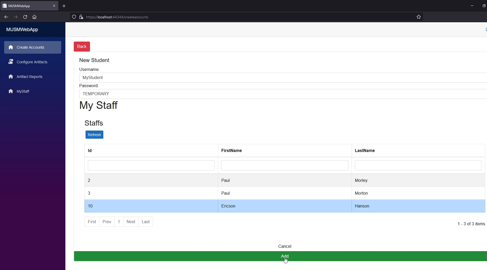
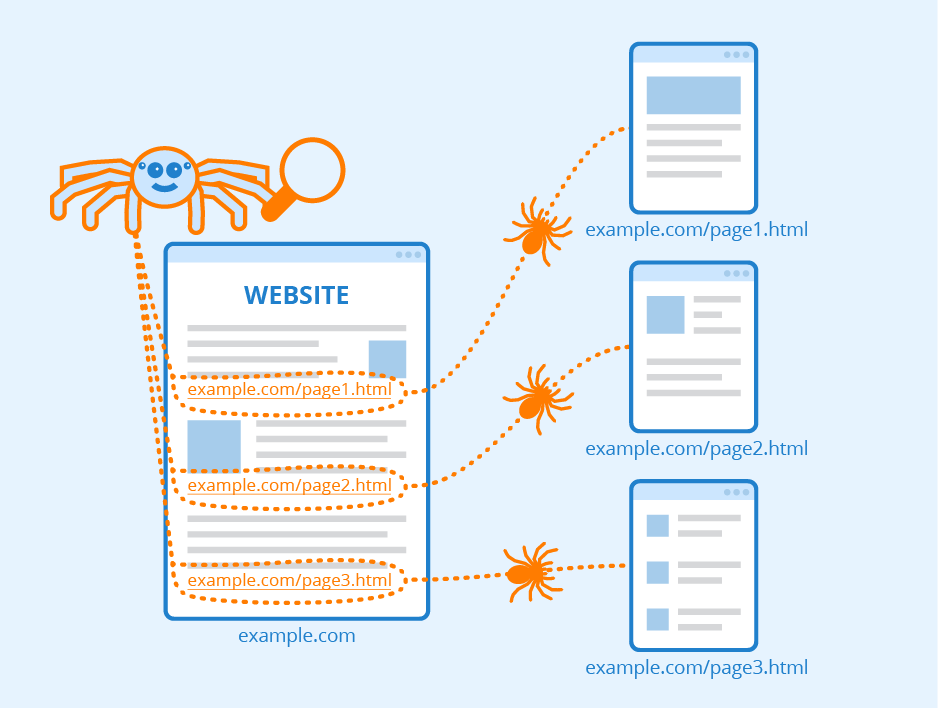
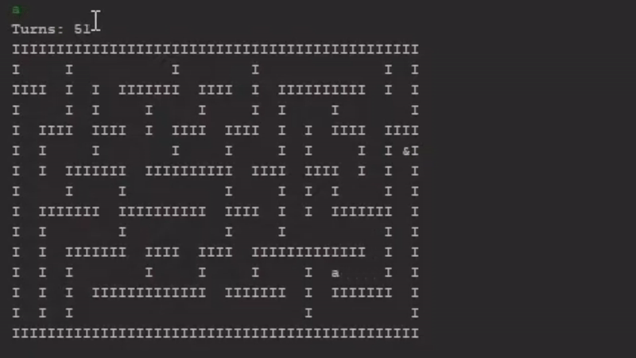
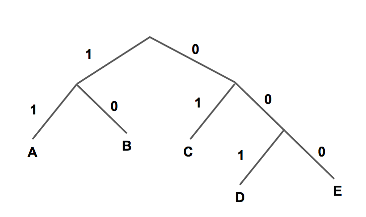

Portfolio
=========

Programming Projects
--------------------

*For access to my private project repositories, please [email me](mailto:cthinkle@csustudent.net?subject=GitHub%20Access) with the subject line, GitHub Access.  
    
<a href="/pdf/resume.pdf">View My Resume</a>

---
### [Medical University Student Management | CSCI 495](project1) 

---
### [Web Crawler | CSCI 315](project2)

---
### [Escape Room Game | CSCI 325](project3)

---
### [Huffman Tree Compressor | CSCI 415](project4)

---

Ethics Papers
-------------

### [Privacy and Anonymity: Essential Rights](/pdf/algorithmsPaper.pdf)

-   **Class: Algorithms**  
-   **Grade: A**

### [The Dangers of Open Source Licensing](/pdf/OSPaper.pdf)

-   **Class: Operating Systems** 
-   **Grade: B**

### [Prioritizing Safety Above Success](/pdf/dataStructuresPaper.pdf)

-   **Class: DataStructures** 
-   **Grade: B**

---

Presentations
-------------

### [Escape Room Presentation](https://youtu.be/RrseaMzpaUc)

- **Class: Object Oriented Programming** 
- **Grade: A**

### [Vending Machine Supplier Database](https://youtu.be/S9QbsSOYDes)

- **Class: Database Management** 
- **Grade: A**

---

Page template forked from <a href="https://github.com/csu-cs/csci-portfolio">CSU-CS</a>

<!-- Remove above link if you don't want to attributive -->
