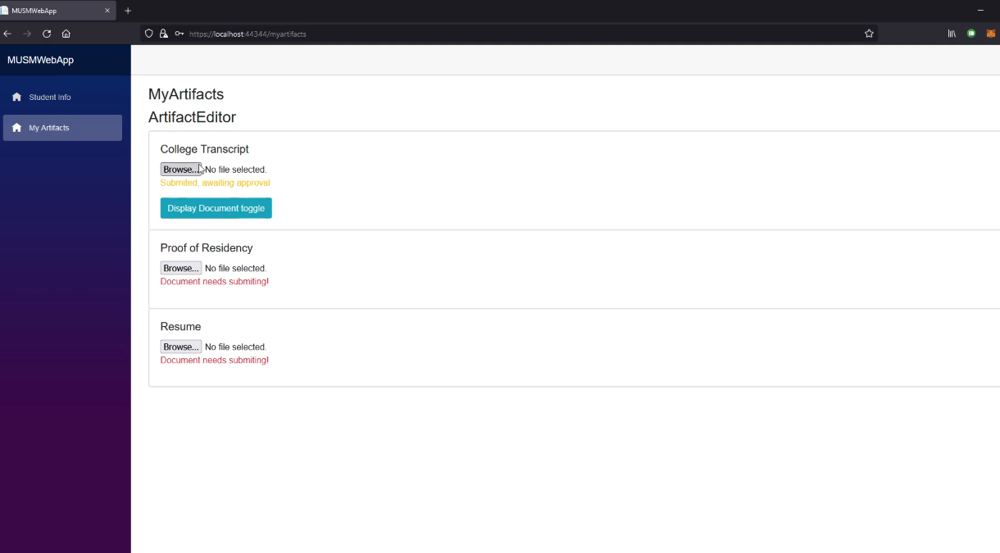

[Back to Portfolio](./)

MUSM Manager
===============

-   **Class: System Analysis and Software Design** 
-   **Grade: A** 
-   **Language(s): C#, html, css** 
-   **Source Code Repository:** [MintyDoggo/SystemAnalysisGroupProject-source](https://github.com/MintyDoggo/SystemAnalysisGroupProject-source)  
    (Please [email me](mailto:cthinkle@csustudent.net?subject=GitHub%20Access) to request access.)

## Project description

This project was made with Brian Hinkle, Christian Hinkle, and Cody Cain. The project consists of a website designed to be generic and scalable for any application that requires a hierarchy of managers and documents. On the website, you can see in Fig 1 that we are logged into the Admin account and can view all staff members and students they correspond to. In Fig 2, we have a view from the staff account perspective which allows the staff to upload documents (artifacts) that they may need to submit. Fig 3 shows the new student page where you can add a student and assign them to a staff ID. Fig 4 shows the required artifacts from the student page. Fig 5 shows the Admin's ability to change the student's login information. It's important to note that in this project, The admin creates accounts for the students and the student does not have the ability to change info, only upon request. Finally, figure 6 shows the student's ability to upload and change artifacts. This project is very big and I cannot show all of the functionality here, so I encourage you to take a look at the project or video below and explore it more.

## How to compile and run the program

```
// Simply open the solution file in VS Community, build and run.
```

## UI Design

  
Fig 1.

  
Fig 2.

  
Fig 3.

  
Fig 4.

  
Fig 5.

  
Fig 6.

## 3. Additional Considerations

Presentation video: https://www.youtube.com/watch?v=s-xzYtd43YM

[Back to Portfolio](./)
