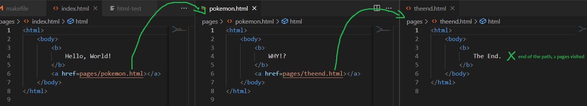
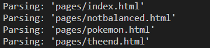
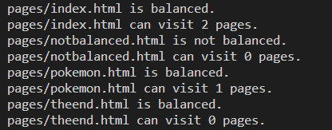

[Back to Portfolio](./)

Web Crawler Page Counter
===============

-   **Class: Data Structures** 
-   **Grade: A**
-   **Language(s): C++**
-   **Source Code Repository:** [MintyDoggo/data-structures-web-crawler](https://github.com/MintyDoggo/data-structures-web-crawler)  
    (Please [email me](mailto:cthinkle@csustudent.net?subject=GitHub%20Access) to request access.)

## Project description

This program is a web crawler that works by starting at one page, navigating to the rest, and then counting the total unique pages visited (Fig 1). It firsts parses the page (Fig 2), outputs if the page is balanced or not, and finally outputs how many possible visits the page has (Fig 3).

## How to compile and run the program

```
// use the makefile in a ubuntu terminal. be sure g++ is installed
make run
make clean
```

## UI Design

There is no UI design since it is a terminal program. The user does not need to do much either since all the program does is determine the path from a specific .html file. The make commands is all the user needs to use in order to interact with this program.

  
Fig 1. href navigation


  
Fig 2. parse of first page


  
Fig 3. is balanced and possible visits


## 3. Additional Considerations

This program was made in linux using makefiles, so you will need to use a ubuntu terminal to run these commands.

[Back to Portfolio](./)
