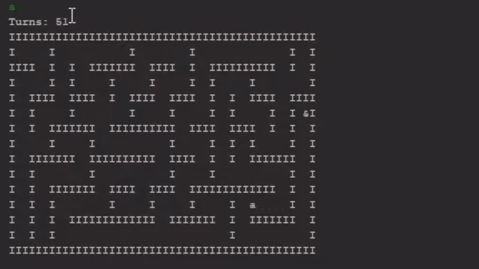

[Back to Portfolio](./)

Escape Room Game
===============

-   **Class: Object Oriented Programming** 
-   **Grade: A** 
-   **Language(s): Java** 
-   **Source Code Repository:** [MintyDoggo/csci-325-Final-Project-Source](https://github.com/MintyDoggo/csci-325-Final-Project-Source)  
    (Please [email me](mailto:cthinkle@csustudent.net?subject=GitHub%20Access) to request access.)

## Project description


## How to compile and run the program

How to compile (if applicable) and run the project.

```
d
```

## UI Design

Almost every program requires user interaction, even command-line programs. Include in this section the tasks the user can complete and what the program does. You don't need to include how it works here; that information may go in the project description or in an additional section, depending on its significance.

  
Fig 1. Main Menu

  
Fig 2. Instructions Menu

  
Fig 3. In Game

  
Fig 4. Map Manager Menu

## 3. Additional Considerations

For more details see [GitHub Flavored Markdown](https://guides.github.com/features/mastering-markdown/).

[Back to Portfolio](./)
