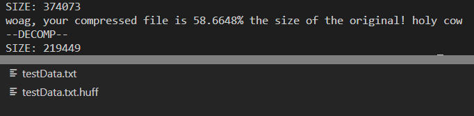

[Back to Portfolio](./)

Huffman Tree Compressor
===============

-   **Class: Algorithms** 
-   **Grade: A**
-   **Language(s): C++**
-   **Source Code Repository:** [MintyDoggo/algorithms-huffman-project](https://github.com/MintyDoggo/algorithms-huffman-project)  
    (Please [email me](mailto:cthinkle@csustudent.net?subject=GitHub%20Access) to request access.)

## Project description

Compresses any file type using Huffman tree compression algorithm. We see the test data (Fig 1) before the program is run and how it is nearly 30,000 lines of data! After running our make command, the program outputs the frequency of each character/byte (Fig 2) and then all character mappings (Fig 3). This was mainly used for debugging but is now a way for the user to understand exactly what happens. We then how much was saved and finally the compressed files end in .huff (Fig 4).

## How to compile and run the program

How to compile (if applicable) and run the project.

```
d
```

## UI Design

Almost every program requires user interaction, even command-line programs. Include in this section the tasks the user can complete and what the program does. You don't need to include how it works here; that information may go in the project description or in an additional section, depending on its significance.

  
Fig 1. 

  
Fig 2. 

  
Fig 3. 

  
Fig 4. 

## 3. Additional Considerations

For more details see [GitHub Flavored Markdown](https://guides.github.com/features/mastering-markdown/).

[Back to Portfolio](./)
