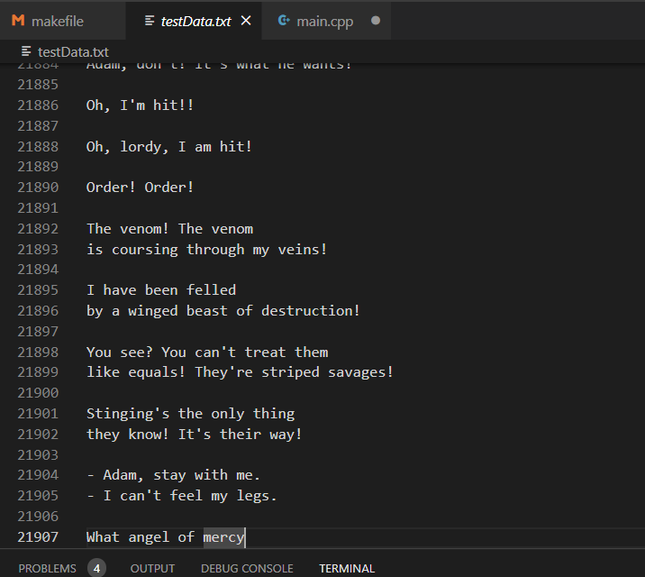
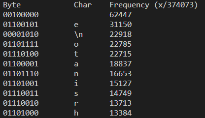
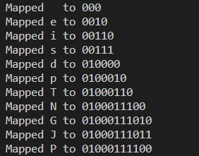
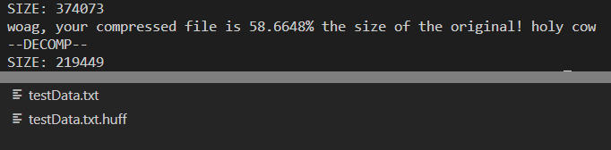

[Back to Portfolio](./)

Huffman Tree Compressor
===============

-   **Class: Algorithms** 
-   **Grade: A**
-   **Language(s): C++**
-   **Source Code Repository:** [MintyDoggo/algorithms-huffman-project](https://github.com/MintyDoggo/algorithms-huffman-project)  
    (Please [email me](mailto:cthinkle@csustudent.net?subject=GitHub%20Access) to request access.)

## Project description

Compresses any file type using Huffman tree compression algorithm. We see the test data (Fig 1) before the program is run and how it is nearly 30,000 lines of data! After running our make command, the program outputs the frequency of each character/byte (Fig 2) and then all character mappings (Fig 3). This was mainly used for debugging but is now a way for the user to understand exactly what happens. We then how much was saved and finally the compressed files end in .huff (Fig 4).

## How to compile and run the program

How to compile (if applicable) and run the project.

```
// use the makefile in a ubuntu terminal. be sure g++ is installed
make test
make clean

// optional but most welcome: use other make commands to compress more files!
make img2
make clean
```

## UI Design

There is no UI design since it is a terminal program. The user does not need to do much either since all the program does is encode and decode files. The make commands is all the user needs to use in order to interact with this program.

  
Fig 1. 


  
Fig 2. 


  
Fig 3. 


  
Fig 4. 


## 3. Additional Considerations

This program was made in linux using makefiles, so you will need to use a ubuntu terminal to run these commands.

[Back to Portfolio](./)
